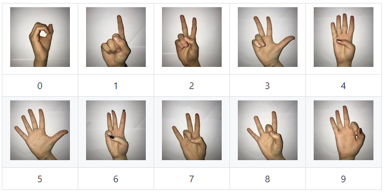

# HAND GESTURE BASED CAPTCHA

### Introduction
###### 
CAPTCHA stands for Completely Automated Public Turing test to tell Computers and Humans Apart. It ensures that the user is a human and not an automated machine. A typical CAPTCHA is a combination of distorted text and numbers as shown in figure below. CAPTCHA is a widely used security mechanism to prevent spammers from submitting automated forms. It is a simple test that tells humans and bots apart. Traditional CAPTCHA’s are a combination of distorted text and numbers or an audio with extra noise. The theory is that humans can correctly identify such distorted text while a bot can’t. However, with the advancement in the field of Artificial Intelligence it is only a matter of time that such CAPTCHA’s will be cracked by bots. These CAPTCHA’s wastes a lot of time and efforts of users.This report aims to explain the creation of a new experimental CAPTCHA that is claimed to provide greater security against spam bots than existing CAPTCHA systems. Report contains a summary of the project. In brief, the project is all about using computer vision to detect sign language, specifically numbers 0 to 9 and thus detect numbers that can be used to solve number-based CAPTCHA puzzles to verify if the user is human or a bot. Using our project, we can provide a 2-layer security to verify users from bots as we use both hand gestures and CAPTCHA based numbers which is very hard to replicate artificially. 

### What is hand gesture?
###### 
 Gestures are a non-verbal form of communication making it an essential part of sign language. Hand gesture is a very powerful medium to communicate with deaf people, therefore it is more suitable solution for CAPTCHA implementation. Here we will only focus on formation of numerical digits with the help of hand gestures. Real-time hand gestures from the user will be captured with the help of a camera and that image frame will be matched with the image of CAPTCHA. If both the images match then it confirms that the user is a human and not a bot..

### Why Hand Gesture CAPTCHA is Better ?
###### 
 Traditional CAPTCHA’s are inaccessible to visually impaired individuals as they rely on visual perception. Even users without impairments can find it difficult to crack the text. To add more security to CAPTCHA, google introduced reCAPTCHA, it sources its text from real world images such as pictures of street address, text from old newspapers and so on. They also introduced image recognition and checkbox CAPTCHA. Here, the set of low resolution or blurry images are shown from where user has to select the images according to the question. These blurry images are also difficult to identify at certain times. Google acknowledges that its reCAPTCHA text is so complicated that even humans can solve it only 87% of the time. All the issues related with traditional CAPTCHA can be solved by replacing it with a hand gesture recognition CAPTCHA. Many individuals communicate primarily using sign language, however there has yet to be devised an artificial system capable of consistently recognizing such motions from films without any extra input. Findings The investigation revealed that it takes time for those who do not utilize sign languages in their daily lives to adjust to the new CAPTCHA at first, but that after a few successful recognitions, they are able to adapt quickly. gesture-based solution may be utilized as a general-purpose captcha system as well as on websites targeted towards sign language groups. With real-time simple gestures, we propose a CAPTCHA system.

### Dataset
###### Signs from [Sign Language Digits Dataset](https://www.kaggle.com/datasets/ardamavi/sign-language-digits-dataset) were used as a reference. As the dataset is too small therefore we created our own dataset. After experimenting with multiple datasets, we realized that all of the datasets had white background, so we tried to a some noise to our images to see the result. Sample of hand gestures is shown in the figure.

### Proposed System
###### 
 In our module, we randomly generate character set and ask the user to show a gesture that corresponds to that character. The user's gesture is taken and processed to determine if it represents the displayed character. If the gesture is correct, the CAPTCHA is solved, and the user is viewed as a human. The figure shows the steps followed to achieve the outcome.

###### 
 A random number is generated by the system and user has to replicate that number using his/her hand gesture, system will capture the image and the region of interest from the image is cropped. This cropped image is then converted into YCbCr format to segment the skin region (hand) from the image. The image is further smoothened with the help of gaussian blurring. To remove unwanted noise in the background by preserving the shape of hand, morphological opening transformations were performed. This pre-processed image is then fed to the train DenseNet121 model to predict the outcome. The predicted outcome of each input is appended to a list and the concatenated string of elements of list are then matched with the string of random generated number. If both these string matches then it confirms that user is human and not a bot so system will allow user to proceed further. So, basically it differentiates the robot and human and provides a good two layered security. 

